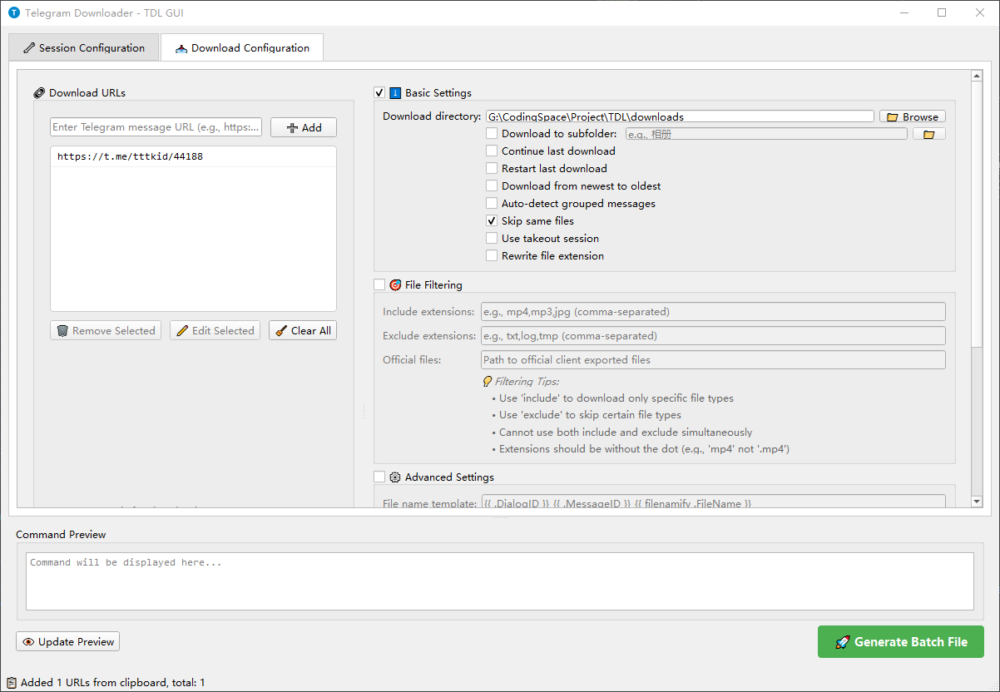

[English](README.md) | [中文](README_CN.md)

# TDL-GUI - Telegram Downloader GUI

A modern, user-friendly graphical interface for [TDL (Telegram Downloader)](https://github.com/iyear/tdl), making it easier to download files from Telegram channels and chats.

> **✨ Bypass Download Restrictions** - Download files and videos from restricted channels that block forwarding/saving. No more Telegram download limitations!

Preview of the download window:



Preview of the floating panel:


## Features

### Core Functionality
- **Intuitive GUI Interface** - Easy-to-use tabbed interface built with PySide6
- **Automatic Clipboard Monitoring** - Automatically detects and adds Telegram links from clipboard
- **Batch Configuration** - Generate Windows batch files for TDL execution
- **Session Management** - Configure TDL session settings (namespace, threads, rate limits)
- **Download Configuration** - Comprehensive download options with preview

### Advanced Features
- **Floating Quick Panel** - Always-on-top panel for quick operations (Ctrl+Shift+F)
- **System Tray Integration** - Minimize to tray, background clipboard monitoring
- **Smart URL Detection** - Supports multiple Telegram URL formats
- **Desktop Notifications** - Windows toast notifications for new link detection
- **Telegram Desktop Login** - Easy login using existing Telegram Desktop session

### Supported URL Formats
- `https://t.me/channel/123`
- `https://t.me/c/1234567890/123`
- `https://t.me/channel/123/456` (message ranges)
- `https://t.me/channel/123?comment=456` (comments)
- `https://t.me/channel/123?thread=456` (forum threads)

## System Requirements

- **Operating System**: Windows 10/11 (64-bit)
- **Python**: 3.11 or higher
- **TDL**: tdl.exe must be placed in `bin/` directory
- **Telegram**: Telegram Desktop installed (for initial login)

## Installation

### Method 1: Download Release (Recommended)

1. Go to the [Releases](../../releases) page of this repository
2. Download the latest version archive
3. Extract to any directory
4. Download [tdl.exe](https://github.com/iyear/tdl/releases) and place it in the `bin/` directory
5. Run `TDL-GUI.exe` or `run.bat`

### Method 2: Run from Source

#### 1. Clone Repository
```bash
git clone https://github.com/yourusername/TDL-GUI.git
cd TDL-GUI
```

#### 2. Install Dependencies
```bash
pip install -r requirements.txt
```

Required packages:
- PySide6 >= 6.5.0 (GUI framework)
- winotify >= 1.1.0 (Windows notifications)

#### 3. Setup TDL Executable
Download [tdl.exe](https://github.com/iyear/tdl/releases) and place it in the `bin/` directory:
```
TDL-GUI/
├── bin/
│   └── tdl.exe          # Place TDL executable here
├── src/
├── run.py
└── requirements.txt
```

#### 4. Run Application
```bash
python run.py
```

## Quick Start Guide

### Initial Setup

#### 1. First Launch - Telegram Login
On first run, TDL-GUI will check your login status:

1. If not logged in, a login dialog will appear
2. Click **Browse** to select your Telegram Desktop directory
   - Default: `C:\Users\YourName\AppData\Roaming\Telegram Desktop`
3. Click **Open Login Terminal**
4. In the terminal window:
   - Use arrow keys to select your account
   - Press Enter to confirm
   - **IMPORTANT**: When asked "Logout from official client?" → Press **N** (No)
5. Wait for "Login successful" message
6. Return to GUI and click **Verify Login**

#### 2. Session Configuration (Optional)
Navigate to **Session Configuration** tab to customize:
- **Namespace**: Data directory for TDL (default: `.tdl`)
- **Threads**: Concurrent download threads (1-32)
- **Rate Limit**: Download speed limit (e.g., `1M`, `500K`)
- **Proxy**: SOCKS5 proxy settings

### Basic Workflow

#### Method 1: Clipboard Monitoring (Recommended)
1. Enable **Clipboard Monitoring** checkbox in Download Configuration tab
2. Copy any Telegram link (Ctrl+C)
3. Link automatically appears in URL list
4. Configure download options
5. Click **Generate Batch File** or use floating panel **Run** button

#### Method 2: Manual URL Entry
1. Navigate to **Download Configuration** tab
2. Paste URLs in the URL list (one per line or comma-separated)
3. Click **Add URLs**
4. Configure download options
5. Click **Generate Batch File**

### Download Configuration Options

#### URL Management
- **Add URLs**: Manually add Telegram links
- **Clear**: Remove all URLs from list
- **Clipboard Monitoring**: Auto-detect new links

#### File Selection
- **Download All Files**: Download all media from links
- **Select by Extension**: Filter specific file types (e.g., `.pdf`, `.mp4`)
- **Select by Regular Expression**: Advanced pattern matching

#### Download Settings
- **Skip Same Files**: Skip already downloaded files
- **Rewrite Files**: Overwrite existing files
- **Takeout Mode**: Use Telegram takeout for large downloads

#### Output Configuration
- **Download Directory**: Destination folder
- **Subfolder Template**: Organize by channel/date (e.g., `{{ .DialogID }}`)
- **Custom Filename**: Rename downloaded files (e.g., `{{ .FileName }}`)

## Advanced Features

### Floating Quick Panel
- **Access**: Ctrl+Shift+F or System Tray menu
- **Features**:
  - Shows current URL count
  - Quick buttons: Clear, Generate BAT, Run
  - Always stays on top
  - Draggable anywhere on screen

### System Tray
Right-click tray icon to access:
- Show/Hide main window
- Toggle floating panel
- Toggle clipboard monitoring
- View current URL count
- Exit application

### Keyboard Shortcuts
- `Ctrl+Shift+F` - Toggle floating panel

## Configuration Files

TDL creates configuration in:
- **Session Data**: `%USERPROFILE%\.tdl\data\`
- **Config File**: `%USERPROFILE%\.tdl\config.yaml`

## Troubleshooting

### Login Issues

**Problem**: "Login verification failed"
- **Solution**: Make sure terminal login completed successfully
- Check session data exists in `%USERPROFILE%\.tdl\data\`
- Try manual login: `bin\tdl.exe login -d "C:\Path\To\Telegram Desktop"`

### TDL Not Found

**Problem**: "tdl.exe not found in bin directory"
- **Solution**: Download tdl.exe from [releases](https://github.com/iyear/tdl/releases)
- Place in `bin/` directory
- Ensure filename is exactly `tdl.exe`

### Clipboard Monitoring Not Working

**Problem**: Links not auto-detected
- **Solution**:
  - Check "Clipboard Monitoring" is enabled
  - URL must be valid Telegram link format
  - Make sure URL is not already in list

### Download Fails

**Problem**: Batch file execution fails
- **Solution**:
  - Verify TDL login status
  - Check URL validity
  - Ensure download directory is accessible
  - Review error messages in batch terminal

### Permission Errors

**Problem**: Cannot write files
- **Solution**:
  - Run as administrator
  - Check download directory permissions
  - Disable antivirus temporarily (may block tdl.exe)

## FAQ

**Q: Is TDL-GUI safe to use?**
A: Yes, it's a GUI wrapper for the official TDL tool. All download operations are performed by TDL.

**Q: Will I be logged out of Telegram Desktop?**
A: No, when prompted during login, press **N** to keep Telegram Desktop logged in.

**Q: Can I download private channels?**
A: Yes, as long as you have access in your Telegram account.

**Q: Does it support Linux/macOS?**
A: Currently Windows only. The underlying TDL supports other platforms, but this GUI is Windows-specific.

**Q: How do I update TDL?**
A: Download the latest tdl.exe from [releases](https://github.com/iyear/tdl/releases) and replace in `bin/` directory.

## License

This project is open source. Please check the license file for details.

## Credits

- **TDL**: [iyear/tdl](https://github.com/iyear/tdl) - Telegram Downloader CLI
- **PySide6**: Qt for Python GUI framework
- **winotify**: Windows 10/11 toast notifications

## Support

For issues related to:
- **TDL-GUI**: Open an issue in this repository
- **TDL Core**: Visit [TDL repository](https://github.com/iyear/tdl)

---

**Note**: This is an unofficial GUI client for TDL. It is not affiliated with Telegram or the TDL project.
